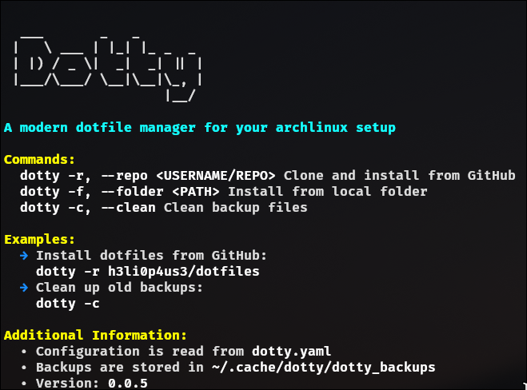

# Dotty - A Modern Dotfile Manager

Dotty is a modern dotfile manager written in Rust that helps you manage your configuration files and packages on Arch Linux systems. It supports installing dotfiles from GitHub repositories or local folders, with automatic package installation and backup management.



## Features

- 📦 Install dotfiles from GitHub repositories or local folders
- 🔄 Automatic package installation (both official repos and AUR)
- 🔒 Automatic backup of existing configuration files
- ⚙️ YAML-based configuration
- 🚀 Fast and reliable (written in Rust)
- 🔧 Easy to use CLI interface

## Installation

### From Source

1. **Clone the repository:**

   ```bash
   git clone https://github.com/h3li0p4us3-moharami/dotty.git
   cd dotty
   ```

2. **Build the project:**

   Ensure you have Rust and Cargo installed. Then run:

   ```bash
   cargo build --release
   ```

3. **Install the binary:**

   After building, you can install the binary to your system:

   ```bash
   cargo install --path .
   ```

## Usage

Dotty provides a command-line interface to manage your dotfiles. Here are some common commands:

- **Clone and install dotfiles from a GitHub repository:**

  ```bash
  dotty -r username/repo
  ```

- **Install dotfiles from a local folder:**

  ```bash
  dotty -f /path/to/dotfiles
  ```
  
- **Clean backup files:**

  ```bash
  dotty -c
  ```

## Configuration

Dotty uses a `dotty.yaml` file to define the configuration for your dotfiles and packages. This file should be located in the root of your dotfiles repository or folder. Here's an example of what it might look like:

```yaml
packages:
  - name: neovim
    is_aur: false
    files:
      - source: config/nvim # source path is relative to the repository root
        destination: ~/.config/nvim
settings:
  skip_existing: false
```

## Contributing

Contributions are welcome! Please fork the repository and submit a pull request for any improvements or bug fixes.

## License

This project is licensed under the MIT License. See the [LICENSE](LICENSE) file for details.

## Acknowledgments

This project was created as a learning exercise to improve my Rust programming skills.
